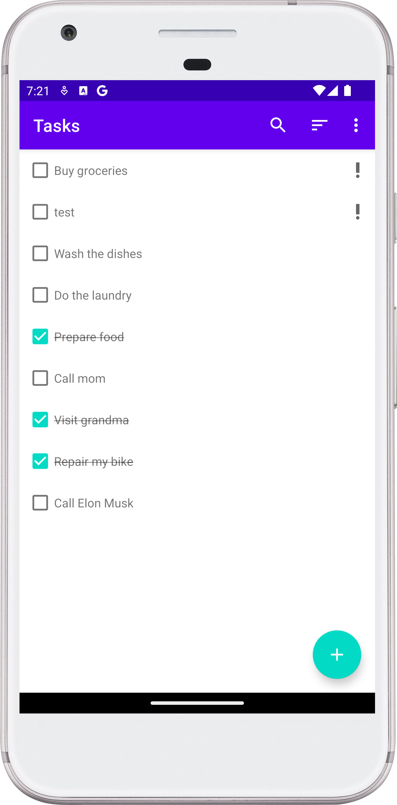
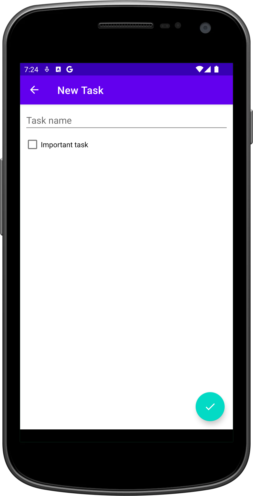

# ToDo App

## Project Description

The ToDo App is an Android mobile application that allows users to manage their tasks efficiently.
The main screen displays a list of tasks with checkboxes. When a checkbox is clicked, the
corresponding task is crossed out. The main screen also features a Floating Action Button (FAB) to
add new tasks, a menu button with options to hide or delete completed tasks, a sort button to sort
tasks by name or date created, and a search button.

## Features

- **Tasks Screen**: Displays tasks with checkboxes. Completed tasks are crossed out.
- **Add New Task**: A screen to add a new task with a text field and an "Important task" checkbox.
- Important tasks are displayed at the top of the list with an exclamation mark.
- **Menu Options**: Options to hide completed tasks and delete all completed tasks.
- **Sort Tasks**: Sort tasks by name or date created.
- **Search Tasks**: Search for tasks using the search button.

## Installation Instructions

1. Download the project.
2. Open the project in Android Studio.
3. Run the project from Android Studio.

## Usage

Once installed, developers can observe a solid example of using MVVM with Hilt, Flow, and
DataStore. The app can be installed on an Android device and used as a to-do list app. Note that
the app is not unique and similar functionality can be found in many other apps on Google Play.

## Technologies Used

- **MVVM
  **: [Monolithic Model-View-ViewModel architecture](https://en.wikipedia.org/wiki/Monolithic_application).
- **Hilt**: Dependency injection library.
- **Flow**: Kotlin's Flow for reactive programming.
- **DataStore**: Jetpack's DataStore for data storage.
- **Code Readability:** code is easily readable with no unnecessary blank lines, no unused variables
  or methods, and no commented-out code, all variables, methods, and resource IDs are descriptively
  named such that another developer reading the code can easily understand their function.

## Contributing

Anyone can contribute by creating a pull request with changes. Contributions are welcome, although
the app currently does not have unique features that differentiate it from other to-do list apps.

## Credits

This project is inspired by the
[MVVMTodo](https://github.com/codinginflow/MVVMTodo/tree/Part-14_Restoring-the-Fragment-SearchView)
project by [Coding in Flow](https://github.com/codinginflow).

## License

This project does not have an intentional license.

• Screenshots:
<!--suppress CheckImageSize -->

